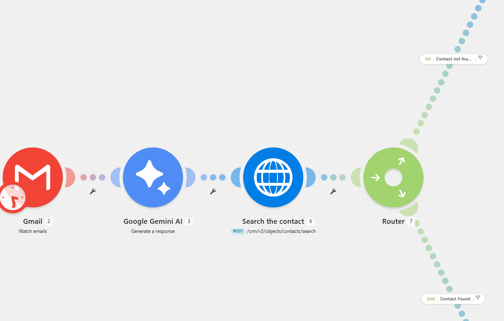
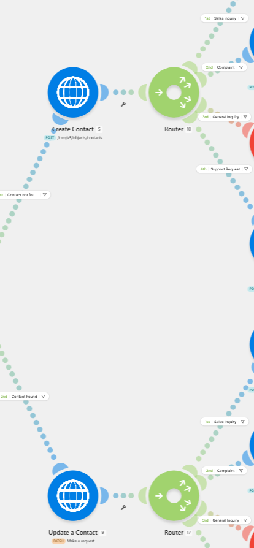
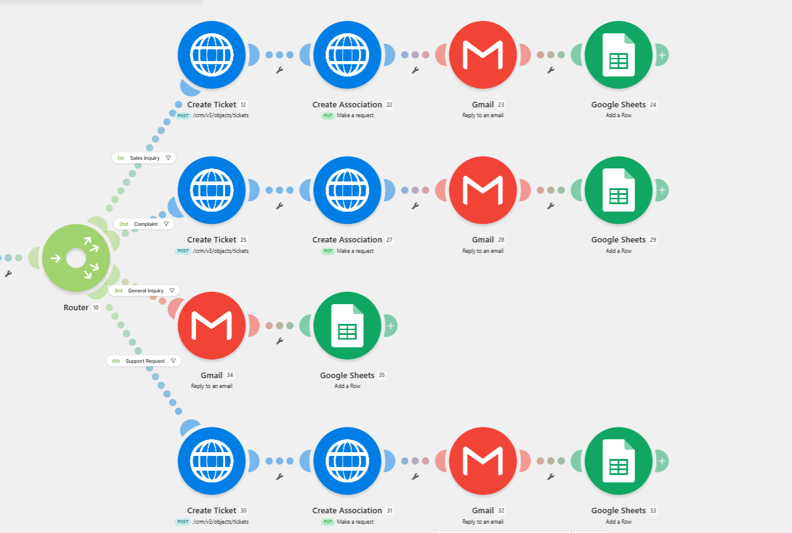
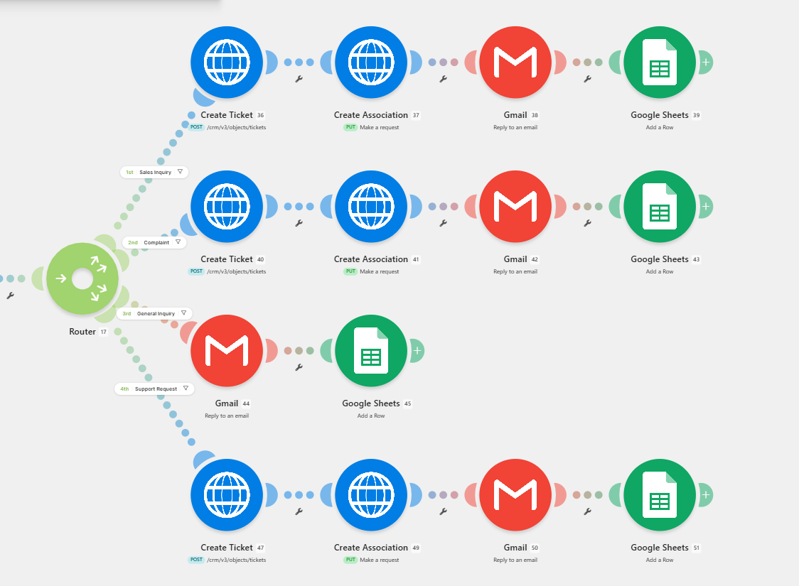
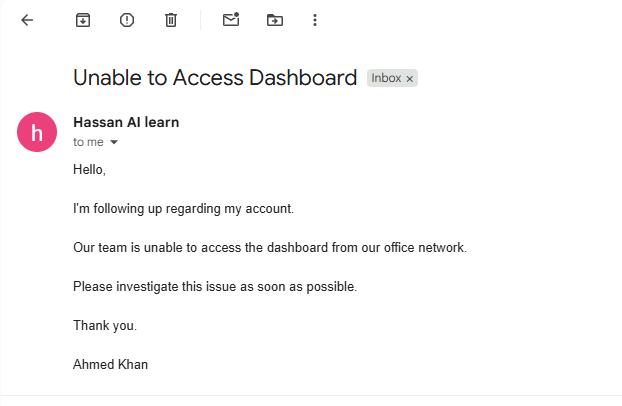
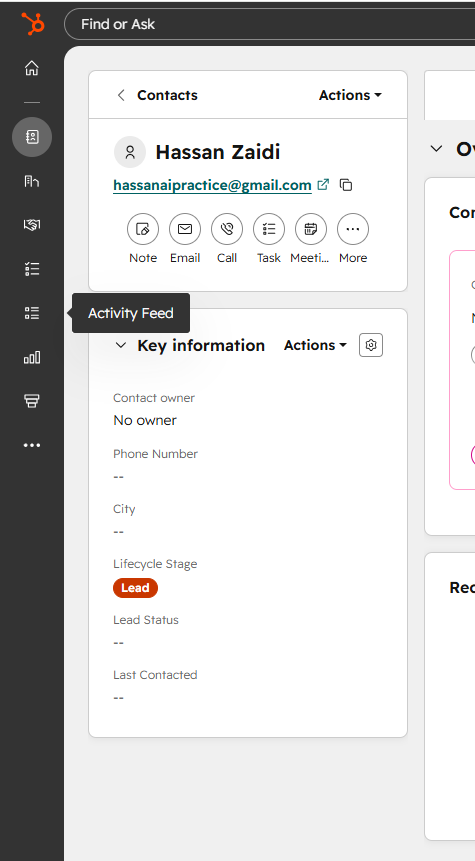
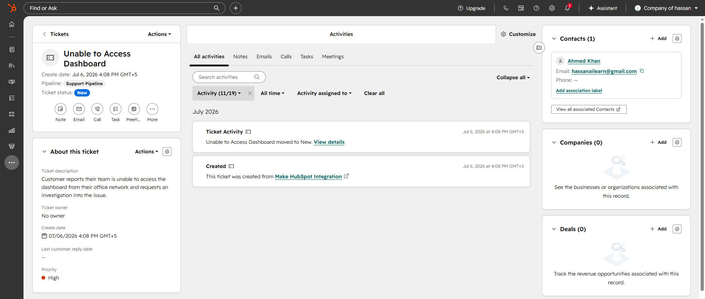
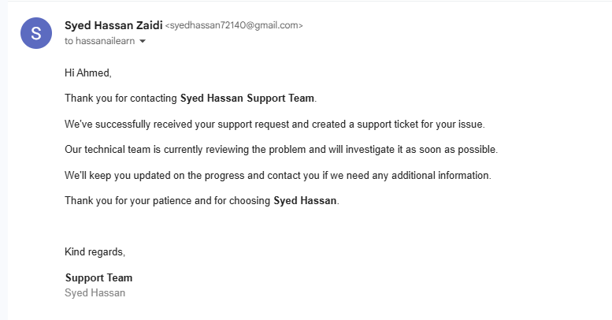
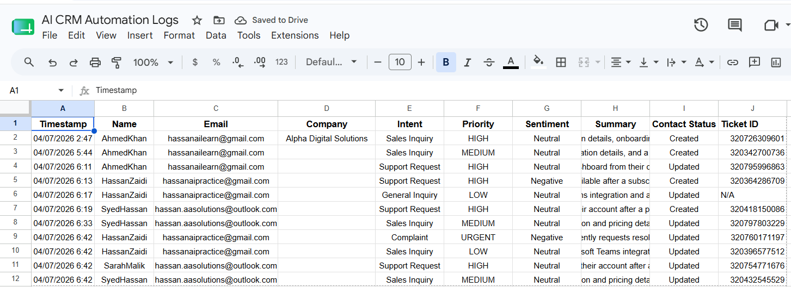

# AI CRM Email Automation

> Automates the complete customer email handling process using AI—from email analysis to CRM updates, ticket creation, automated replies, and activity logging.


---

## Overview

This project automates how customer emails are handled inside a CRM system.

Instead of manually reading emails, identifying customer requests, updating CRM records, creating support tickets, replying to customers, and maintaining logs, the entire process is handled automatically using **Make.com**, **Google Gemini AI**, **HubSpot CRM**, **Gmail**, and **Google Sheets**.

The workflow intelligently understands customer emails, updates the CRM, creates support tickets when required, sends acknowledgement emails, and records every interaction for future tracking.

---

## Why I Built This

Customer support teams spend a significant amount of time performing repetitive tasks such as:

- Reading incoming emails
- Understanding customer requests
- Updating CRM records
- Creating support tickets
- Sending acknowledgement emails
- Maintaining activity logs

I built this project to automate this complete workflow using AI, reducing manual effort while keeping customer information organized and consistent.

---

## Automation Flow

1. A customer sends an email.
2. Gmail triggers the Make.com workflow.
3. Google Gemini AI analyzes the email and extracts customer information.
4. The workflow searches HubSpot for an existing contact.
5. A new contact is created or the existing contact is updated.
6. AI identifies the customer's intent, priority, sentiment, and generates a summary.
7. A HubSpot support ticket is created.
8. The ticket is associated with the correct contact.
9. An acknowledgement email is automatically sent to the customer.
10. The complete interaction is logged in Google Sheets.


---

## Features

### AI Email Analysis

- Reads incoming customer emails
- Extracts customer information
- Detects customer intent
- Determines priority
- Performs sentiment analysis
- Generates a concise summary

### CRM Automation

- Searches existing contacts
- Creates new contacts
- Updates existing contacts
- Creates HubSpot support tickets
- Associates tickets with contacts

### Customer Communication

- Sends automatic acknowledgement emails

### Activity Logging

- Stores processed requests in Google Sheets

---

## Tech Stack

- Make.com
- Google Gemini AI
- HubSpot CRM
- HubSpot REST API
- Gmail
- Google Sheets
- HTTP Modules

---

## Repository Structure

```
.
├── docs/
│
├── workflow/
│   ├── architecture-diagram.png
│   ├── email-processing.png
│   ├── contact-management.png
│   ├── new-contact-workflow.png
│   └── existing-contact-workflow.png
│
├── screenshots/
│   ├── test-email.png
│   ├── contact-created.png
│   ├── ticket-details-and-association.png
│   ├── auto-reply-email.png
│   └── google-sheets-log.png
│
└── README.md
```

---

# Workflow

## Email Processing Workflow

Incoming email is received, analyzed by Gemini AI, and customer information is extracted.



---

## Contact Management Workflow

The workflow checks whether the customer already exists in HubSpot.



---

## New Contact Flow

If the customer does not exist, a new HubSpot contact is created before continuing with ticket creation.



---

## Existing Contact Flow

If the customer already exists, the existing HubSpot contact is updated before processing the request.



---

# Results

## Sample Customer Email



---

## HubSpot Contact Record

A customer contact is automatically created or updated inside HubSpot.



---

## HubSpot Ticket & Contact Association

Support tickets are automatically created and linked with the correct customer.



---

## Automated Email Response

Customers instantly receive an acknowledgement email after their request is processed.



---

## Google Sheets Activity Log

Every processed request is logged automatically for reporting and tracking.



---

## Example AI Output

The AI extracts and generates the following information from each email:

- Customer Name
- Email Address
- Company
- Intent
- Priority
- Sentiment
- Summary

This structured data is then used throughout the automation workflow.

---

## Author

**Hassan Haider Abbas**

GitHub: https://github.com/HassanHaider-ai
